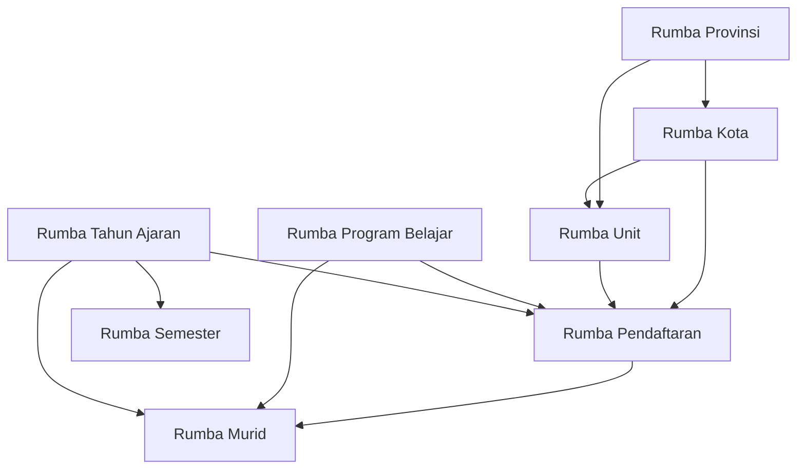

# Current DocType Inventory - Rumba16

Sumber inventaris:

- Custom DocType: `rumba16/bimbel_rumba_v16/doctype/*/*.json`
- Controller dan client file: `rumba16/bimbel_rumba_v16/doctype/*/*.{py,js}`
- Client Script fixture: `rumba16/fixtures/client_script.json`
- Hook app: `rumba16/hooks.py`

Catatan umum:

- Tidak ditemukan DocType dengan `istable = 1`; semua DocType custom saat ini adalah DocType utama, bukan Child Table.
- Tidak ditemukan fixture Workflow Frappe. Workflow yang ada masih berupa field status dan validasi/script, bukan dokumen `Workflow`.
- File `.js` per DocType masih template/comment-only. Script aktif berada di fixture `Client Script`.
- Hampir semua controller Python selain `Rumba Pendaftaran` masih class kosong turunan `Document`.

## Ringkasan DocType

| DocType | Jenis | Naming | Relasi utama |
| --- | --- | --- | --- |
| Rumba Provinsi | Master | `field:kode_provinsi` | - |
| Rumba Kota | Master | `field:kode_kota` | Rumba Provinsi |
| Rumba Unit | Master | `field:nama_unit` | Rumba Kota, Rumba Provinsi, Employee, Cost Center, Warehouse |
| Rumba Program Belajar | Master | `field:kode_program_belajar` | - |
| Rumba Tahun Ajaran | Master | `field:nama_tahun_ajaran` | - |
| Rumba Semester | Master | `autoincrement` | Rumba Tahun Ajaran |
| Rumba Ruangan | Master | `field:kode_ruangan` | - |
| Rumba Pendaftaran | Transaction | by script | Rumba Kota, Rumba Unit, Rumba Program Belajar, Rumba Tahun Ajaran, Rumba Murid, Customer, Sales Invoice, User |
| Rumba Murid | Master | `field:nomor_induk_murid` | Rumba Pendaftaran, Rumba Tahun Ajaran, Rumba Program Belajar, Customer |

## Rumba Provinsi

1. **Nama DocType**: Rumba Provinsi
2. **Jenis**: Master
3. **Tujuan DocType**: Menyimpan master provinsi untuk referensi wilayah pada kota dan unit Rumba.
4. **Daftar field penting**:
   - `kode_provinsi` (Data, wajib, unik, list view)
   - `nama_provinsi` (Data, wajib, unik, list view)
5. **Relasi Link**: Tidak ada field Link.
6. **Child Table**: Tidak ada.
7. **Workflow terkait**: Tidak ada workflow Frappe; tidak ada field status.
8. **Script terkait**:
   - Controller: `rumba_provinsi.py`, class kosong `RumbaProvinsi`.
   - Client JS file: `rumba_provinsi.js`, template/comment-only.
   - Client Script fixture: tidak ada.
9. **Potensi masalah desain**:
   - `kode_provinsi` dan `nama_provinsi` sama-sama unik; ini baik untuk master kecil, tetapi perlu aturan format kode yang konsisten.
   - Tidak ada normalisasi uppercase/trim untuk kode provinsi.
10. **Dependensi dengan DocType lain**:
   - Digunakan oleh `Rumba Kota.kode_provinsi`.
   - Digunakan oleh `Rumba Unit.kode_provinsi`.

## Rumba Kota

1. **Nama DocType**: Rumba Kota
2. **Jenis**: Master
3. **Tujuan DocType**: Menyimpan master kota/kabupaten dan menghubungkannya ke provinsi.
4. **Daftar field penting**:
   - `kode_kota` (Data, wajib, unik, list view)
   - `nama_kota` (Data, wajib, list view)
   - `kode_provinsi` (Link ke Rumba Provinsi, wajib)
   - `nama_provinsi` (Data, read-only, list view)
5. **Relasi Link**:
   - `kode_provinsi` -> `Rumba Provinsi`
6. **Child Table**: Tidak ada.
7. **Workflow terkait**: Tidak ada workflow Frappe; tidak ada field status.
8. **Script terkait**:
   - Controller: `rumba_kota.py`, class kosong `RumbaKota`.
   - Client JS file: `rumba_kota.js`, template/comment-only.
   - Client Script fixture: tidak ada.
9. **Potensi masalah desain**:
   - Field `nama_provinsi` read-only kemungkinan perlu fetch otomatis dari `kode_provinsi`; metadata belum menunjukkan fetch/from script khusus.
   - Naming memakai `kode_kota`, tetapi label field Link di DocType lain kadang memakai `nama_kota`, sehingga naming bisa membingungkan.
10. **Dependensi dengan DocType lain**:
   - Bergantung pada `Rumba Provinsi`.
   - Digunakan oleh `Rumba Unit.kode_kota`.
   - Digunakan oleh `Rumba Pendaftaran.nama_kota`.

## Rumba Unit

1. **Nama DocType**: Rumba Unit
2. **Jenis**: Master
3. **Tujuan DocType**: Menyimpan data unit/cabang Rumba, identitas wilayah, kontak, kapasitas, dan relasi ke master ERPNext untuk operasional.
4. **Daftar field penting**:
   - `nama_unit` (Data, wajib, unik, list view)
   - `kode_unit` (Data, unik, read-only, list view)
   - `kode_kota` (Link ke Rumba Kota, wajib)
   - `kode_provinsi` (Link ke Rumba Provinsi, wajib)
   - `nama_kota` (Data, read-only, list view)
   - `nama_provinsi` (Data, read-only)
   - `kepemilikan` (Select: YRKI, Franchise, Partnership)
   - `tanggal_mulai` (Date, wajib, list view)
   - `status_unit` (Select: Rintisan, Aktif, Pindah, Tutup)
   - `email_unit` (Data, wajib, unik)
   - `telepon_unit` (Phone, wajib, list view)
   - `koordinator_unit` (Link ke Employee)
   - `jumlah_ruang_kelas` (Int, wajib)
   - `kapasitas_max_sesi_belajar_minggu` (Int, read-only)
   - `kapasitas_max_murid` (Int, read-only)
   - `cost_center` (Link ke Cost Center)
   - `warehouse` (Link ke Warehouse)
5. **Relasi Link**:
   - `kode_kota` -> `Rumba Kota`
   - `kode_provinsi` -> `Rumba Provinsi`
   - `koordinator_unit` -> `Employee`
   - `cost_center` -> `Cost Center`
   - `warehouse` -> `Warehouse`
6. **Child Table**: Tidak ada.
7. **Workflow terkait**:
   - Tidak ada workflow Frappe.
   - Status operasional ditangani oleh field `status_unit`.
8. **Script terkait**:
   - Controller: `rumba_unit.py`, class kosong `RumbaUnit`.
   - Client JS file: `rumba_unit.js`, template/comment-only.
   - Client Script fixture:
     - `Generate Kapasitas Sesi Belajar per Minggu`: saat `jumlah_ruang_kelas` berubah, mengisi `kapasitas_max_sesi_belajar_minggu = jumlah_ruang_kelas * 40`.
     - `Generate Kapasitas Max Murid`: menghitung `kapasitas_max_murid = kapasitas_max_sesi_belajar_minggu * 3`.
     - `Warna Status Unit dan Kepemilikan`: list formatter untuk `status_unit` dan `kepemilikan`.
9. **Potensi masalah desain**:
   - `kode_unit` read-only dan unik, tetapi tidak terlihat logic server/client yang mengisinya.
   - Perhitungan kapasitas hanya client-side; impor data/API/server-side save dapat melewati perhitungan.
   - List formatter memetakan `Crowdfunding`, tetapi pilihan `kepemilikan` di metadata adalah `YRKI`, `Franchise`, `Partnership`. Nilai `Partnership` tidak dipetakan, sedangkan `Crowdfunding` bukan opsi.
   - Field `nama_kota` dan `nama_provinsi` read-only perlu mekanisme fetch yang jelas agar tidak stale.
10. **Dependensi dengan DocType lain**:
   - Bergantung pada `Rumba Kota`, `Rumba Provinsi`, `Employee`, `Cost Center`, dan `Warehouse`.
   - Digunakan oleh `Rumba Pendaftaran.nama_unit`.
   - Secara tidak langsung menjadi sumber `kode_unit` untuk penomoran `Rumba Pendaftaran`.

## Rumba Program Belajar

1. **Nama DocType**: Rumba Program Belajar
2. **Jenis**: Master
3. **Tujuan DocType**: Menyimpan master program belajar yang dapat dipilih saat pendaftaran dan data murid.
4. **Daftar field penting**:
   - `kode_program_belajar` (Data, wajib, unik)
   - `program_belajar` (Data, wajib, list view)
5. **Relasi Link**: Tidak ada field Link.
6. **Child Table**: Tidak ada.
7. **Workflow terkait**: Tidak ada workflow Frappe; tidak ada field status/nonaktif.
8. **Script terkait**:
   - Controller: `rumba_program_belajar.py`, class kosong `RumbaProgramBelajar`.
   - Client JS file: `rumba_program_belajar.js`, template/comment-only.
   - Client Script fixture:
     - `Kode Program Belajar AllCaps`: uppercase dan trim `kode_program_belajar`.
9. **Potensi masalah desain**:
   - Normalisasi kode hanya client-side, belum server-side.
   - Tidak ada field nonaktif/status, sehingga program lama tetap muncul kecuali ditangani lewat permission/filter lain.
10. **Dependensi dengan DocType lain**:
   - Digunakan oleh `Rumba Pendaftaran.program_belajar`.
   - Digunakan oleh `Rumba Murid.program_belajar`.

## Rumba Tahun Ajaran

1. **Nama DocType**: Rumba Tahun Ajaran
2. **Jenis**: Master
3. **Tujuan DocType**: Menyimpan periode tahun ajaran, tanggal mulai/selesai, dan status aktif/arsip.
4. **Daftar field penting**:
   - `nama_tahun_ajaran` (Data, wajib, unik, list view)
   - `kode_tahun_ajaran` (Data, unik, read-only)
   - `tanggal_mulai` (Date, wajib, list view)
   - `tanggal_selesai` (Date, read-only)
   - `nonaktif` (Check)
   - `status` (Select: Aktif, Arsip, list view)
5. **Relasi Link**: Tidak ada field Link.
6. **Child Table**: Tidak ada.
7. **Workflow terkait**:
   - Tidak ada workflow Frappe.
   - Status periode ditangani oleh `status` dan `nonaktif`.
8. **Script terkait**:
   - Controller: `rumba_tahun_ajaran.py`, class kosong `RumbaTahunAjaran`.
   - Client JS file: `rumba_tahun_ajaran.js`, template/comment-only.
   - Client Script fixture:
     - `Tanggal Akhir Tahun Ajaran`: saat `tanggal_mulai` berubah, mengisi `tanggal_selesai` ke 30 Juni tahun berikutnya.
     - `Warna Status Tahun Ajaran`: list formatter untuk field `status`.
9. **Potensi masalah desain**:
   - `kode_tahun_ajaran` read-only dan unik, tetapi tidak terlihat logic yang mengisinya.
   - Perhitungan `tanggal_selesai` hanya client-side.
   - Ada dua konsep status (`nonaktif` dan `status`) yang bisa saling bertentangan jika tidak ada validasi.
10. **Dependensi dengan DocType lain**:
   - Digunakan oleh `Rumba Semester.kode_tahun_ajaran`.
   - Digunakan oleh `Rumba Pendaftaran.tahun_ajaran`.
   - Digunakan oleh `Rumba Murid.tahun_ajaran`.

## Rumba Semester

1. **Nama DocType**: Rumba Semester
2. **Jenis**: Master
3. **Tujuan DocType**: Menyimpan semester dalam sebuah tahun ajaran beserta periode tanggalnya.
4. **Daftar field penting**:
   - `kode_semester` (Data, unik, read-only)
   - `nama_semester` (Data, read-only, list view)
   - `periode_semester` (Select: S1 Jul-Des, S2 Jan-Jun, wajib)
   - `kode_tahun_ajaran` (Link ke Rumba Tahun Ajaran, wajib, list view)
   - `tanggal_mulai_semester` (Date, read-only, list view)
   - `tanggal_akhir_semester` (Date, read-only, list view)
   - `nonaktif` (Check)
5. **Relasi Link**:
   - `kode_tahun_ajaran` -> `Rumba Tahun Ajaran`
6. **Child Table**: Tidak ada.
7. **Workflow terkait**:
   - Tidak ada workflow Frappe.
   - Status aktif/nonaktif hanya melalui `nonaktif`.
8. **Script terkait**:
   - Controller: `rumba_semester.py`, class kosong `RumbaSemester`.
   - Client JS file: `rumba_semester.js`, template/comment-only.
   - Client Script fixture:
     - `Generate Nama Semester`: mengambil `Rumba Tahun Ajaran`, lalu mengisi `kode_semester`, `nama_semester`, `tanggal_mulai_semester`, dan `tanggal_akhir_semester`.
9. **Potensi masalah desain**:
   - Client Script memakai `frappe.ui.form.on('Semester', ...)`, bukan `Rumba Semester`; kemungkinan script tidak berjalan untuk DocType ini.
   - Naming memakai `autoincrement`, sementara identitas bisnis ada di `kode_semester`; ini dapat membuat nama dokumen tidak bermakna.
   - Perhitungan tanggal/kode hanya client-side dan bergantung format teks tahun ajaran yang mengandung dua tahun.
10. **Dependensi dengan DocType lain**:
   - Bergantung pada `Rumba Tahun Ajaran`.
   - Berpotensi menjadi referensi jadwal/akademik ke depan, tetapi belum digunakan oleh DocType custom lain.

## Rumba Ruangan

1. **Nama DocType**: Rumba Ruangan
2. **Jenis**: Master
3. **Tujuan DocType**: Menyimpan master ruangan/kelas.
4. **Daftar field penting**:
   - `kode_ruangan` (Data, wajib, unik, list view)
   - `nama_ruangan` (Data, wajib, list view)
5. **Relasi Link**: Tidak ada field Link.
6. **Child Table**: Tidak ada.
7. **Workflow terkait**: Tidak ada workflow Frappe; tidak ada field status/nonaktif.
8. **Script terkait**:
   - Controller: `rumba_ruangan.py`, class kosong `RumbaRuangan`.
   - Client JS file: `rumba_ruangan.js`, template/comment-only.
   - Client Script fixture: tidak ada.
9. **Potensi masalah desain**:
   - Belum ada relasi ke `Rumba Unit`, sehingga ruangan tampak global, bukan per cabang.
   - Belum ada field kapasitas/status ruangan.
10. **Dependensi dengan DocType lain**:
   - Tidak bergantung pada DocType lain.
   - Belum digunakan oleh DocType custom lain.

## Rumba Pendaftaran

1. **Nama DocType**: Rumba Pendaftaran
2. **Jenis**: Transaction
3. **Tujuan DocType**: Menangani proses pendaftaran murid, mulai dari pilihan kota/unit/program/jadwal, data anak dan keluarga, validasi admin, pembuatan Customer, pembuatan Sales Invoice, sinkronisasi pembayaran, sampai pembuatan data `Rumba Murid`.
4. **Daftar field penting**:
   - `nama_kota` (Link ke Rumba Kota)
   - `nama_unit` (Link ke Rumba Unit, list view)
   - `kode_unit` (Data, read-only)
   - `program_belajar` (Link ke Rumba Program Belajar, wajib, list view)
   - `jenis_kelas` (Select: Reguler, Private, Semi-Private, wajib, list view)
   - `senin`, `selasa`, `rabu`, `kamis`, `jumat`, `sabtu` (Check)
   - `jam_belajar` (Select jam belajar)
   - `nama_lengkap` (Data, wajib, list view)
   - `nama_panggilan` (Data, wajib)
   - `tanggal_lahir` (Date, wajib)
   - `jenis_kelamin` (Select)
   - `anak_sudah_sekolah` (Select, wajib)
   - `anak_berkebutuhan_khusus` (Select, wajib)
   - `nama_orang_tua_wali` (Data, wajib)
   - `hubungan_dengan_anak` (Select, wajib)
   - `alamat` (Small Text, wajib)
   - `nomor_handphone` (Data/Phone, wajib)
   - `alamat_email` (Data/Email, wajib)
   - `tanggal_pendaftaran` (Date, read-only)
   - `status_pendaftaran` (Select: Menunggu, Disetujui, Ditolak, Batal, list view)
   - `tahun_ajaran` (Link ke Rumba Tahun Ajaran, wajib, list view)
   - `murid_rumba` (Link ke Rumba Murid, hidden)
   - `customer_orang_tua` (Link ke Customer, read-only)
   - `duplicate_check_key` (Data, read-only, hidden, no-copy)
   - `sales_invoice` (Link ke Sales Invoice, read-only, standard filter)
   - `status_pembayaran` (Select: Belum Ditagih, Menunggu Pembayaran, Dibayar Sebagian, Lunas, Dibatalkan, read-only, list view, standard filter)
   - `tanggal_pembayaran` (Date, read-only, standard filter)
5. **Relasi Link**:
   - `nama_kota` -> `Rumba Kota`
   - `nama_unit` -> `Rumba Unit`
   - `program_belajar` -> `Rumba Program Belajar`
   - `tahun_ajaran` -> `Rumba Tahun Ajaran`
   - `disetujui_oleh` -> `User`
   - `murid_rumba` -> `Rumba Murid`
   - `customer_orang_tua` -> `Customer`
   - `sales_invoice` -> `Sales Invoice`
6. **Child Table**: Tidak ada.
7. **Workflow terkait**:
   - Tidak ada workflow Frappe.
   - Alur status manual melalui `status_pendaftaran`.
   - Validasi server mencegah `status_pendaftaran = Disetujui` jika `status_pembayaran` belum `Lunas`.
   - Status pembayaran disimpan di `status_pembayaran` dan dapat disinkronkan dari `Sales Invoice`.
8. **Script terkait**:
   - Controller `rumba_pendaftaran.py`:
     - `autoname`: membuat nomor dari `kode_unit + YY + MM + series 2 digit`.
     - `validate`: set/validasi kode unit, normalisasi nomor HP, set duplicate key, validasi duplikasi, validasi approval harus lunas.
     - `buat_sales_invoice`: membuat `Sales Invoice` untuk pendaftaran.
     - `sinkronkan_pembayaran`: membaca status/outstanding invoice dan mengisi `status_pembayaran` serta `tanggal_pembayaran`.
   - Client JS file: `rumba_pendaftaran.js`, template/comment-only.
   - Client Script fixture:
     - `Pilihan Kota dan Unit`: filter `nama_unit` berdasarkan `nama_kota`.
     - `Tombol Buat Murid`: membuat `Rumba Murid` dari pendaftaran yang sudah disetujui.
     - `Tombol Customer Orang Tua`: membuat/membuka `Customer`.
     - `Tombol Buat Invoice`: membuat/membuka invoice dan menjalankan sinkronisasi pembayaran manual.
   - Hook `doc_events`:
     - `Sales Invoice.on_update_after_submit/on_cancel` diarahkan ke `sync_status_pembayaran_from_sales_invoice`.
     - `Payment Entry.on_submit/on_cancel` diarahkan ke `sync_status_pembayaran_from_payment_entry`.
9. **Potensi masalah desain**:
   - DocType transaksi tidak `is_submittable`; kontrol proses bergantung pada field status dan validasi, bukan submit/cancel.
   - `set_kode_unit()` mencari field `unit`, `cabang`, atau `rumba_cabang`, padahal metadata memakai `nama_unit`; jika `kode_unit` belum terisi dari client/fetch, autoname bisa gagal.
   - Client Script filter unit memakai `kode_kota: frm.doc.nama_kota`; karena `nama_kota` adalah Link ke `Rumba Kota`, nilai yang tersimpan adalah document name/kode kota. Ini bisa benar, tetapi label field berpotensi membingungkan.
   - Pembuatan `Rumba Murid` dilakukan dari client dengan `frappe.client.insert`, sehingga business rule pembuatan murid belum terkonsolidasi server-side.
   - Field `status_pendaftaran` bisa diubah manual; tidak ada Workflow Frappe untuk approval, penolakan, atau pembatalan.
   - Hook `doc_events` mengarah ke fungsi `sync_status_pembayaran_from_sales_invoice` dan `sync_status_pembayaran_from_payment_entry`, tetapi fungsi tersebut tidak terlihat di `rumba_pendaftaran.py`. Ini berisiko error saat event ERPNext berjalan.
   - `tanggal_pendaftaran` read-only, tetapi autoname bergantung pada field ini atau `nowdate()`. Perlu kepastian default agar nomor konsisten.
   - Pembuatan Customer memakai nilai hardcoded `customer_group = Individual` dan `territory = Indonesia`; site harus memiliki master tersebut.
   - Pembuatan invoice bergantung default Company user/global dan item yang dipilih manual.
10. **Dependensi dengan DocType lain**:
   - Bergantung pada master custom `Rumba Kota`, `Rumba Unit`, `Rumba Program Belajar`, dan `Rumba Tahun Ajaran`.
   - Membuat/menghubungkan `Rumba Murid`.
   - Membuat/menghubungkan ERPNext `Customer` dan `Sales Invoice`.
   - Sinkronisasi pembayaran bergantung pada `Sales Invoice` dan `Payment Entry`.
   - Menggunakan `User` untuk field persetujuan.

## Rumba Murid

1. **Nama DocType**: Rumba Murid
2. **Jenis**: Master
3. **Tujuan DocType**: Menyimpan data murid aktif/pasca-pendaftaran, termasuk identitas, asal pendaftaran, unit/program, jadwal belajar, dan data orang tua/customer.
4. **Daftar field penting**:
   - `nomor_induk_murid` (Data, unik, list view)
   - `nama_lengkap` (Data, read-only, list view)
   - `nama_panggilan` (Data, read-only)
   - `tanggal_lahir` (Date, read-only, list view)
   - `jenis_kelamin` (Select, read-only)
   - `pendaftaran` (Link ke Rumba Pendaftaran)
   - `tanggal_pendaftaran` (Date, read-only)
   - `status_murid` (Select: Aktif, Cuti, Lulus, Berhenti, list view)
   - `nama_unit` (Data, list view, standard filter)
   - `kode_unit` (Data)
   - `tahun_ajaran` (Link ke Rumba Tahun Ajaran)
   - `jenis_kelas` (Select)
   - `program_belajar` (Link ke Rumba Program Belajar, list view, standard filter)
   - `senin`, `selasa`, `rabu`, `kamis`, `jumat`, `sabtu` (Check)
   - `jam_belajar` (Select jam belajar)
   - `nama_orang_tua_wali` (Data, read-only, list view)
   - `customer` (Link ke Customer)
   - `hubungan_dengan_anak` (Data, read-only)
   - `nomor_handphone` (Data)
   - `alamat_email` (Data)
   - `alamat` (Small Text)
5. **Relasi Link**:
   - `pendaftaran` -> `Rumba Pendaftaran`
   - `tahun_ajaran` -> `Rumba Tahun Ajaran`
   - `program_belajar` -> `Rumba Program Belajar`
   - `customer` -> `Customer`
6. **Child Table**: Tidak ada.
7. **Workflow terkait**:
   - Tidak ada workflow Frappe.
   - Status lifecycle murid ditangani oleh `status_murid`.
8. **Script terkait**:
   - Controller: `rumba_murid.py`, class kosong `RumbaMurid`.
   - Client JS file: `rumba_murid.js`, template/comment-only.
   - Client Script fixture:
     - `Warna Status Murid`: list formatter/indicator untuk `status_murid`.
   - Dibuat dari Client Script `Tombol Buat Murid` pada `Rumba Pendaftaran`.
9. **Potensi masalah desain**:
   - Banyak field identitas read-only, tetapi pembuatan murid dilakukan client-side; perubahan langsung/API dapat membuat data tidak sinkron dengan pendaftaran.
   - `nama_unit` bertipe Data tetapi memiliki `options = Rumba Unit`; jika memang relasi ke unit diperlukan, sebaiknya Link.
   - Field `customer` tidak otomatis diisi dari `customer_orang_tua` pada script pembuatan murid saat ini.
   - `nomor_induk_murid` unik tetapi tidak wajib; karena dipakai sebagai naming field, record tanpa nilai bisa bermasalah.
   - Tidak ada validasi server untuk mencegah lebih dari satu murid dari pendaftaran yang sama.
10. **Dependensi dengan DocType lain**:
   - Bergantung pada `Rumba Pendaftaran` sebagai sumber data.
   - Bergantung pada `Rumba Tahun Ajaran` dan `Rumba Program Belajar`.
   - Berelasi ke ERPNext `Customer`.

## Dependensi Antar DocType Custom

## Dependensi ERPNext Core

| DocType custom | ERPNext/Core dependency |
| --- | --- |
| Rumba Unit | Employee, Cost Center, Warehouse |
| Rumba Pendaftaran | User, Customer, Sales Invoice, Item, Company defaults, Payment Entry hook |
| Rumba Murid | Customer |

## Catatan Risiko Prioritas

1. `hooks.py` mereferensikan dua fungsi sinkronisasi pembayaran yang tidak terlihat di `rumba_pendaftaran.py`: `sync_status_pembayaran_from_sales_invoice` dan `sync_status_pembayaran_from_payment_entry`.
2. `Rumba Pendaftaran.set_kode_unit()` belum membaca field `nama_unit`, padahal itu field Link unit di metadata.
3. Script `Generate Nama Semester` memakai DocType `Semester`, bukan `Rumba Semester`.
4. Banyak perhitungan/fetch penting masih client-side saja, sehingga bisa tidak berjalan saat data dibuat lewat import, API, patch, atau server script.
5. Belum ada Workflow Frappe untuk approval pendaftaran; status proses masih berupa Select biasa dengan sebagian validasi server.
